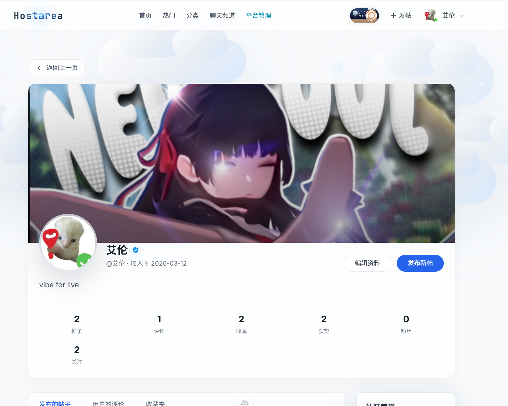

# HostArea - AI-Powered Community Platform

<p align="center">
  
  
  
</p>

<p align="center">
  
</p>

> A modern tech community platform integrating AI assistant Alma for intelligent group chat collaboration and management, powered by LLM Tool Use architecture.

<!-- README-I18N:START -->

[**English**](./README_en.md) | [中文](./README.md)

<!-- README-I18N:END -->

---

## ✨ Features

### 🤖 AI Assistant Alma

Alma is an innovative AI assistant built on the **LLM Tool Use** architecture. Unlike traditional chatbots that only return text responses, Alma can actually **execute actions**:

| Tool | Description |
|------|-------------|
| `user_query` | Query user information, ban history |
| `channel_ban` | Ban user from channel |
| `global_ban` | Global platform ban |
| `channel_mute` | Mute user in channel |
| `revoke_message` | Revoke inappropriate messages |
| `post_delete` | Delete posts violating guidelines |
| `web_search` | Search the web for real-time information |
| `memory_recall` | Recall user context from memory |
| `memory_save` | Save information to memory |

**Example**: When an admin types "ban user ZhangSan for 30 minutes", Alma understands the intent and automatically calls the `channel_ban` tool to complete the action.

**Key Features:**
- Multi-turn conversation with context awareness
- Web search augmentation for real-time answers
- User profile recall from memory
- Distributed state management via `bot_pending_actions` table

### 💬 Multi-Channel Real-Time Chat

- **Multiple Channels**: Community Hall, Concept Lounge, Tech Discussion, Random Chat, and more
- **Message Types**: Text, images, code snippets, system notifications
- **Streaming Response**: SSE-based AI responses for real-time feel
- **Message Management**: Recall, pin, reactions

### 📝 Content Community

- **Post Publishing**: Share tech articles, questions, discussions
- **Categories**: Programming, DevOps, AI/ML, Career, Random
- **Interactions**: Comments, likes, bookmarks, hot ranking
- **Content Moderation**: Manual review queue, AI-assisted detection

### 🎛️ Admin Dashboard

- **Data Overview**: User statistics, post counts, channel metrics
- **User Management**: View, warn, mute, ban, delete users
- **Content Audit**: Review pending posts, handle reports
- **Database Operations**: Direct SQL query interface for administrators
- **System Logs**: Track admin actions and system events

### 🔐 Permission System

- **Authentication**: Laravel Sanctum token-based auth
- **Roles**: Normal users, moderators, administrators
- **Channel Permissions**: Per-channel ban/mute controls
- **Global Permissions**: Platform-wide ban and management rights

---

## 🛠️ Tech Stack

### Backend
- **Framework**: Laravel 11
- **Database**: MySQL 8.0
- **Authentication**: Laravel Sanctum
- **API Style**: RESTful API

### Frontend
- **Framework**: Nuxt.js 4 (Vue 3)
- **Styling**: Tailwind CSS
- **State Management**: Pinia
- **HTTP Client**: Axios

### AI Integration
- **LLM Provider**: SiliconFlow API
- **Model**: GLM-4-Flash
- **Architecture**: LLM Tool Use

---

## 📁 Project Structure

```
host-area/
├── host-area-backend/        # Laravel Backend
│   ├── app/
│   │   ├── Http/Controllers/    # API Controllers
│   │   ├── Models/               # Eloquent Models
│   │   ├── Services/             # Business Logic
│   │   └── Tools/                # Alma Tool Implementations
│   ├── database/
│   │   └── migrations/            # Database Migrations
│   └── routes/
│       └── api.php                # API Routes
│
├── host-area-frontend/       # Nuxt.js Frontend
│   ├── components/              # Vue Components
│   ├── pages/                   # Route Pages
│   ├── stores/                  # Pinia Stores
│   └── composables/             # Vue Composables
│
└── host-area-paper/          # Graduation Thesis
```

---

## 🚀 Quick Start

### Requirements

- PHP 8.2+
- Composer 2.x
- Node.js 18+
- MySQL 8.0+
- SiliconFlow API Key

### Backend Setup

```bash
cd host-area-backend

# Install dependencies
composer install

# Configure environment
cp .env.example .env
php artisan key:generate

# Configure database in .env, then:
php artisan migrate
php artisan db:seed --class=AdminSeeder

# Start development server
php artisan serve
```

### Frontend Setup

```bash
cd host-area-frontend

# Install dependencies
npm install

# Configure environment
cp .env.example .env

# Start development server
npm run dev
```

### Environment Variables

**Backend (`.env`):**
```env
APP_NAME=HostArea
APP_URL=http://localhost:8000

DB_CONNECTION=mysql
DB_HOST=127.0.0.1
DB_PORT=3306
DB_DATABASE=host_area
DB_USERNAME=root
DB_PASSWORD=your_password

SANCTUM_STATEFUL_DOMAINS=localhost:3000

SILICONFLOW_API_KEY=your_api_key
```

**Frontend (`.env`):**
```env
NUXT_PUBLIC_API_BASE_URL=http://localhost:8000/api
```

---

## 📊 Database Schema

### Core Tables

| Table | Description |
|-------|-------------|
| `users` | User accounts and profiles |
| `channels` | Chat channels |
| `messages` | Chat messages |
| `posts` | Community posts |
| `comments` | Post comments |
| `likes` | Likes and bookmarks |
| `bot_pending_actions` | AI action confirmation states |
| `memory_entries` | AI memory storage |

### Permission Tables

| Table | Description |
|-------|-------------|
| `user_roles` | User role assignments |
| `permissions` | Permission definitions |
| `user_bans` | Ban records |
| `channel_mutes` | Mute records |

---

## 🎯 Architecture Highlights

### LLM Tool Use Flow

```
User Input → LLM Intent Recognition → Tool Selection → Action Execution → Response
                                     ↓
                              Permission Check
                              (Admin Only Tools)
                                     ↓
                              Confirmation State (Destructive Actions)
```

### Distributed State Management

The `bot_pending_actions` table enables reliable AI action confirmation in distributed environments:

```sql
CREATE TABLE bot_pending_actions (
    id BIGINT UNSIGNED AUTO_INCREMENT PRIMARY KEY,
    tool_name VARCHAR(255) NOT NULL,
    tool_args JSON NOT NULL,
    status ENUM('pending', 'confirmed', 'cancelled', 'expired') DEFAULT 'pending',
    created_at TIMESTAMP NULL,
    expires_at TIMESTAMP NULL
);
```

---

## 🙏 Acknowledgments

- [Laravel](https://laravel.com/) - PHP Framework
- [Nuxt.js](https://nuxt.com/) - Vue.js Framework
- [SiliconFlow](https://siliconflow.cn/) - LLM API Provider
- [Tailwind CSS](https://tailwindcss.com/) - Utility-First CSS Framework

---

<p align="center">
  <sub>Built for a graduation project · 2025</sub>
</p>
